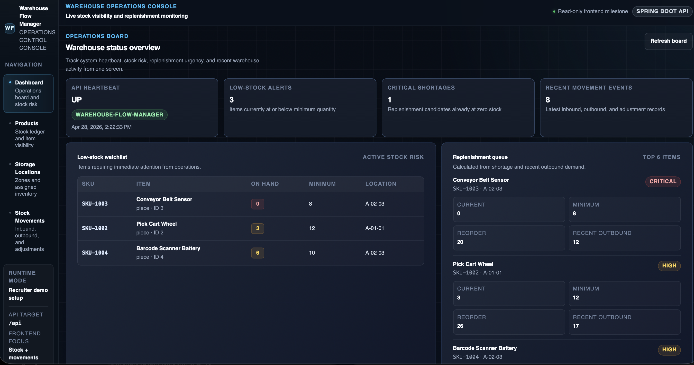
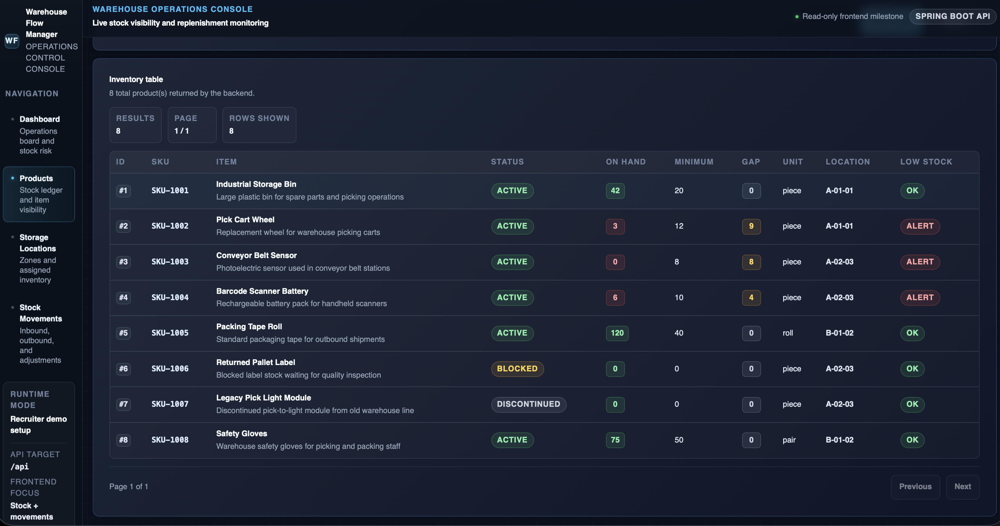
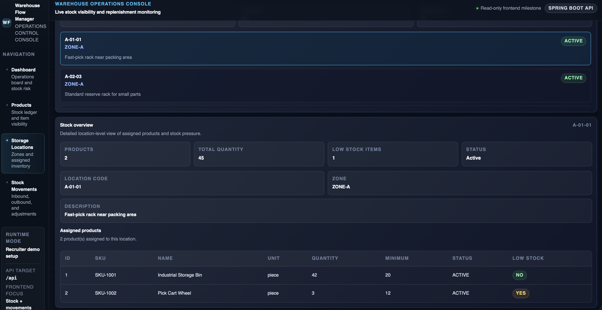
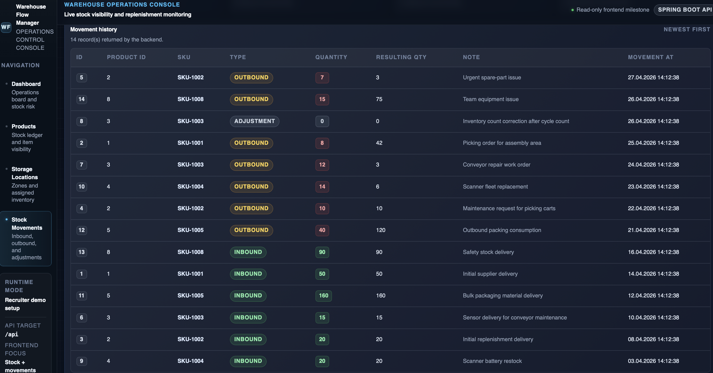
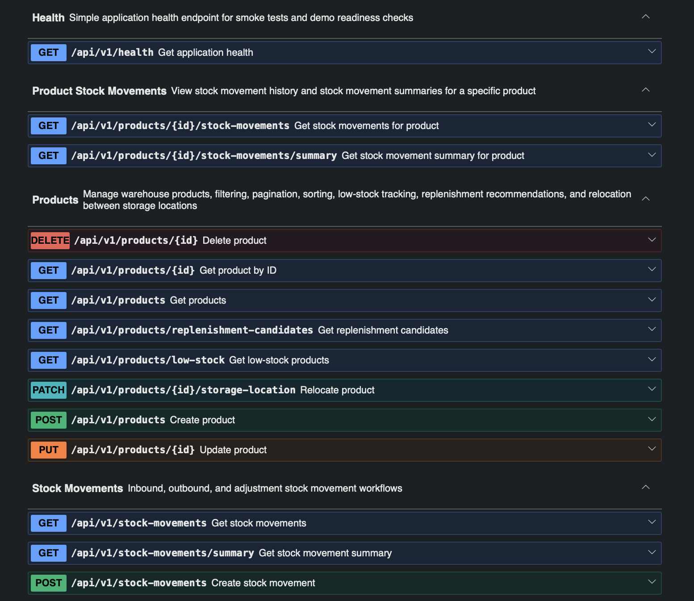
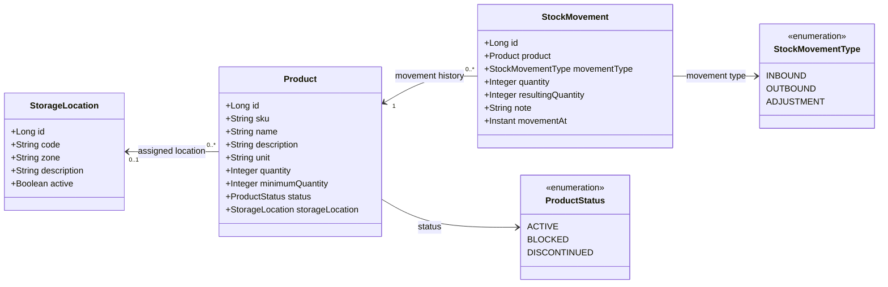
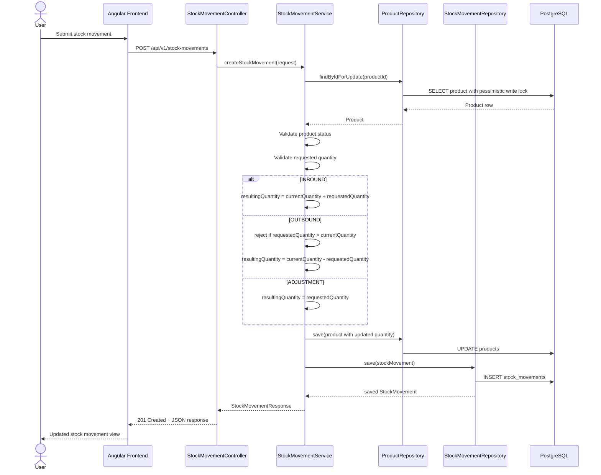

# Warehouse Flow Manager

Full-stack warehouse operations demo built with Spring Boot, Angular, PostgreSQL, Flyway, Docker, OpenAPI, and Playwright.

The application provides a versioned REST API and an Angular operations-console frontend for managing warehouse products, storage locations, stock movements, low-stock monitoring, and replenishment support.

---

## Overview

Warehouse Flow Manager is a portfolio project designed to demonstrate a clean, interview-defensible full-stack application for a Java/Angular developer role.

The backend is built with **Spring Boot 4**, **Java 21**, **PostgreSQL**, **Spring Data JPA**, and **Flyway**.

The frontend is built with **Angular**, **TypeScript**, and **SCSS**, using feature-focused architecture, centralized API services, feature facades, and mocked Playwright E2E tests.

The project demonstrates:

- versioned REST API design under `/api/v1`
- business-rule driven backend logic
- PostgreSQL persistence with Flyway migrations
- Angular feature architecture
- centralized frontend API services
- centralized frontend error mapping
- backend integration tests
- frontend unit/API tests
- mocked Playwright E2E tests
- Docker-based dev/demo workflows

---

## Screenshots

### Operations Dashboard

The dashboard gives a quick overview of API health, low-stock risk, critical shortages, replenishment urgency, and recent warehouse activity.



### Product Inventory

The product inventory view shows paginated stock data, product status, current quantity, minimum quantity, stock gaps, assigned locations, and low-stock indicators.



### Storage Location Visibility

The storage location view shows active and inactive warehouse locations, assigned stock, location-level quantities, and low-stock exposure per location.



### Stock Movement Monitoring

The stock movement view shows inbound, outbound, and adjustment activity with movement summaries and traceable stock history.



### Swagger / OpenAPI Documentation

The backend exposes documented, versioned REST endpoints under `/api/v1` through Swagger UI.



---

## Main Features

### Product management

- Create, read, update, and delete products
- Filter by status and storage location
- Search by SKU or product name
- Paginate and sort product lists
- Prevent direct quantity changes through product updates
- Relocate products to another storage location through a dedicated endpoint

### Storage location management

- Create, read, update, and delete storage locations
- Prevent deletion when products are still assigned
- Mark locations as active or inactive
- Prevent assigning products to inactive locations
- Show stock overview per storage location

### Stock movement handling

- Create `INBOUND`, `OUTBOUND`, and `ADJUSTMENT` movements
- Update product stock through controlled business rules
- Prevent outbound quantities from exceeding available stock
- Prevent stock movements for blocked products
- Keep stock movement history for traceability

### Inventory monitoring

- Return low-stock products
- Generate replenishment candidates
- Prioritize replenishment using:
  - current shortage against minimum quantity
  - recent outbound demand
  - business priority levels: `CRITICAL`, `HIGH`, `MEDIUM`

### Frontend operations console

- Dashboard with warehouse KPIs
- Product inventory visibility
- Low-stock and replenishment views
- Stock movement overview
- Storage location overview
- Mocked E2E-tested user flows

### API quality

- Versioned API routes under `/api/v1`
- Structured JSON error responses
- Bean validation for request bodies, path variables, and query parameters
- OpenAPI documentation via Swagger UI
- Health endpoint for smoke tests and local checks

---

## Architecture Diagram

```text
┌───────────────────────────────────────────────────────────────┐
│ Angular Frontend                                              │
│                                                               │
│ - Dashboard                                                   │
│ - Products                                                    │
│ - Stock Movements                                             │
│ - Storage Locations                                           │
│ - API Services                                                │
│ - Feature Facades                                             │
└───────────────────────────────────────────────────────────────┘
                              │
                              │ HTTP / JSON
                              ▼
┌───────────────────────────────────────────────────────────────┐
│ Spring Boot Backend                                           │
│                                                               │
│  ┌─────────────────────────────────────────────────────────┐  │
│  │ Controller Layer                                        │  │
│  │ - ProductController                                     │  │
│  │ - ProductStockMovementController                        │  │
│  │ - StorageLocationController                             │  │
│  │ - StockMovementController                               │  │
│  │ - HealthController                                      │  │
│  └─────────────────────────────────────────────────────────┘  │
│                              │                                │
│                              ▼                                │
│  ┌─────────────────────────────────────────────────────────┐  │
│  │ Service Layer                                           │  │
│  │ - ProductService                                        │  │
│  │ - StorageLocationService                                │  │
│  │ - StockMovementService                                  │  │
│  │                                                         │  │
│  │ Contains business rules such as:                        │  │
│  │ - stock validation                                      │  │
│  │ - relocation rules                                      │  │
│  │ - low-stock detection                                   │  │
│  │ - replenishment recommendation logic                    │  │
│  └─────────────────────────────────────────────────────────┘  │
│                              │                                │
│                              ▼                                │
│  ┌─────────────────────────────────────────────────────────┐  │
│  │ Repository Layer                                        │  │
│  │ - ProductRepository                                     │  │
│  │ - StorageLocationRepository                             │  │
│  │ - StockMovementRepository                               │  │
│  └─────────────────────────────────────────────────────────┘  │
│                                                               │
│  ┌─────────────────────────────────────────────────────────┐  │
│  │ Common / Cross-Cutting Components                       │  │
│  │ - ApiPaths                                              │  │
│  │ - GlobalExceptionHandler                                │  │
│  │ - ApiErrorResponse                                      │  │
│  │ - PagedResponse                                         │  │
│  │ - OpenApiConfig                                         │  │
│  └─────────────────────────────────────────────────────────┘  │
└───────────────────────────────────────────────────────────────┘
                              │
                              ▼
┌───────────────────────────────────────────────────────────────┐
│ PostgreSQL Database                                           │
│ Tables:                                                       │
│ - storage_locations                                           │
│ - products                                                    │
│ - stock_movements                                             │
└───────────────────────────────────────────────────────────────┘
                              ▲
                              │
┌───────────────────────────────────────────────────────────────┐
│ Flyway Migrations                                             │
│ - V1__init_schema.sql                                         │
│ - V2__align_current_schema.sql                                │
│ - V3__drop_legacy_product_table.sql                           │
│ - V4__make_storage_location_description_optional.sql          │
└───────────────────────────────────────────────────────────────┘
```

## Design Diagrams

### Domain Model UML



### Stock Movement Sequence



---

## Architecture Notes

The backend follows a classic layered design.

### Controller layer

The controller layer exposes REST endpoints and validates incoming HTTP requests. It is responsible for:

- endpoint routing
- request/response mapping
- parameter validation
- HTTP status codes
- OpenAPI annotations

### Service layer

The service layer contains the main business logic, including:

- SKU uniqueness checks
- storage location activity checks
- low-stock detection
- replenishment calculation
- relocation rules
- stock update rules
- deletion constraints

### Repository layer

The repository layer uses Spring Data JPA to interact with PostgreSQL. It provides:

- CRUD access
- filtered queries
- stock movement aggregation queries
- pessimistic locking for concurrency-safe stock updates

### Common layer

The common layer centralizes reusable concerns such as:

- versioned API path constants
- paginated response wrappers
- OpenAPI configuration
- custom exception types
- global error handling

### Frontend structure

The frontend is organized around feature areas and shared core infrastructure.

The main frontend structure includes:

- core API services
- centralized API path constants
- centralized frontend error message mapping
- feature facades for state and action handling
- UI-focused Angular components
- mocked Playwright E2E tests

---

## Domain Model

The system centers around three main entities.

### `StorageLocation`

Represents a physical warehouse location.

Fields:

- `id`
- `code`
- `zone`
- `description`
- `active`

### `Product`

Represents an inventory item.

Fields:

- `id`
- `sku`
- `name`
- `description`
- `unit`
- `quantity`
- `minimumQuantity`
- `status`
- `storageLocation`

### `StockMovement`

Represents a stock-changing event for a product.

Fields:

- `id`
- `product`
- `movementType`
- `quantity`
- `resultingQuantity`
- `note`
- `movementAt`

---

## Tech Stack

### Backend

- Java 21
- Spring Boot 4
- Spring Web
- Spring Validation
- Spring Data JPA
- Hibernate
- PostgreSQL
- Flyway
- Swagger / springdoc-openapi
- JUnit 5
- MockMvc
- Maven

### Frontend

- Angular
- TypeScript
- SCSS
- Angular HTTP client
- Feature facade pattern
- Playwright
- Vitest / Angular test runner

### Infrastructure

- Docker
- Docker Compose
- Shell scripts for dev and demo workflows

---

## Project Structure

```text
warehouse-flow-manager/
├── docs/
│   └── screenshots/
│       ├── dashboard-overview.png
│       ├── product-inventory.png
│       ├── stock-movements.png
│       ├── storage-locations.png
│       └── swagger-openapi.png
├── frontend/
│   ├── e2e/
│   │   ├── mocks/
│   │   │   └── warehouse-api.mock.ts
│   │   ├── app-shell.spec.ts
│   │   ├── dashboard.spec.ts
│   │   ├── products.spec.ts
│   │   ├── stock-movements.spec.ts
│   │   ├── storage-locations.spec.ts
│   │   └── tsconfig.json
│   ├── src/
│   │   ├── app/
│   │   │   ├── core/
│   │   │   │   ├── api/
│   │   │   │   └── error/
│   │   │   └── features/
│   │   │       ├── dashboard/
│   │   │       ├── products/
│   │   │       ├── stock-movements/
│   │   │       └── storage-locations/
│   │   ├── styles.scss
│   │   ├── proxy.conf.json
│   │   └── proxy.demo.conf.json
│   ├── angular.json
│   ├── package.json
│   └── playwright.config.ts
├── scripts/
│   ├── demo/
│   │   ├── reset-demo-db.sh
│   │   ├── run-demo.sh
│   │   ├── run-demo-test.sh
│   │   └── stop-demo.sh
│   └── dev/
│       ├── reset-dev-db.sh
│       ├── run-dev.sh
│       ├── run-dev-test.sh
│       └── stop-dev.sh
├── src/
│   ├── main/
│   │   ├── java/com/example/warehouseflowmanager/
│   │   │   ├── common/
│   │   │   │   ├── api/
│   │   │   │   ├── dto/
│   │   │   │   └── exception/
│   │   │   ├── controller/
│   │   │   ├── product/
│   │   │   │   ├── controller/
│   │   │   │   ├── dto/
│   │   │   │   ├── entity/
│   │   │   │   ├── repository/
│   │   │   │   └── service/
│   │   │   ├── stockmovement/
│   │   │   │   ├── controller/
│   │   │   │   ├── dto/
│   │   │   │   ├── entity/
│   │   │   │   ├── repository/
│   │   │   │   └── service/
│   │   │   ├── storagelocation/
│   │   │   │   ├── controller/
│   │   │   │   ├── dto/
│   │   │   │   ├── entity/
│   │   │   │   ├── repository/
│   │   │   │   └── service/
│   │   │   └── WarehouseFlowManagerApplication.java
│   │   └── resources/
│   │       ├── db/
│   │       │   ├── demo/
│   │       │   └── migration/
│   │       ├── application.yml
│   │       ├── application-demo.yml
│   │       └── application-sql-debug.yml
│   └── test/
│       └── java/com/example/warehouseflowmanager/
│           ├── product/controller/
│           ├── stockmovement/controller/
│           ├── storagelocation/controller/
│           └── WarehouseFlowManagerApplicationTests.java
├── Dockerfile
├── docker-compose.yml
├── docker-compose-dev.yml
├── pom.xml
├── .env.example
├── .env              # local demo config, not committed
└── .env.dev          # local dev config, not committed
```

---

## API Modules

All API routes are versioned under:

```text
/api/v1
```

### Products

Base path: `/api/v1/products`

Main endpoints:

- `POST /api/v1/products`
- `GET /api/v1/products`
- `GET /api/v1/products/{id}`
- `PUT /api/v1/products/{id}`
- `DELETE /api/v1/products/{id}`
- `PATCH /api/v1/products/{id}/storage-location`
- `GET /api/v1/products/low-stock`
- `GET /api/v1/products/replenishment-candidates`

### Product stock movements

Base path: `/api/v1/products/{id}`

Main endpoints:

- `GET /api/v1/products/{id}/stock-movements`
- `GET /api/v1/products/{id}/stock-movements/summary`

### Storage locations

Base path: `/api/v1/storage-locations`

Main endpoints:

- `POST /api/v1/storage-locations`
- `GET /api/v1/storage-locations`
- `GET /api/v1/storage-locations/{id}`
- `PUT /api/v1/storage-locations/{id}`
- `DELETE /api/v1/storage-locations/{id}`
- `GET /api/v1/storage-locations/{id}/stock-overview`

### Stock movements

Base path: `/api/v1/stock-movements`

Main endpoints:

- `POST /api/v1/stock-movements`
- `GET /api/v1/stock-movements`
- `GET /api/v1/stock-movements/summary`

### Health

- `GET /api/v1/health`

---

## Business Rules

The backend enforces several warehouse-specific rules:

- Product SKU must be unique
- Storage location code must be unique
- Products cannot be assigned to inactive storage locations
- Blocked products cannot be created with initial stock
- Blocked products cannot participate in stock movements
- Product quantity cannot be changed through the update-product endpoint
- Product quantity must be changed through stock movements only
- Outbound quantity cannot exceed current stock
- Storage locations cannot be deleted while products are assigned
- Products cannot be deleted while stock exists
- Products cannot be deleted when stock movement history exists
- Relocation to the same storage location is rejected

---

## Error Response Format

Validation and business errors are returned in a consistent JSON structure.

Example:

```json
{
  "timestamp": "2026-04-21T20:30:00Z",
  "status": 400,
  "error": "Bad Request",
  "message": "Validation failed",
  "path": "/api/v1/products",
  "validationErrors": {
    "size": "Size must be greater than 0"
  }
}
```

---

## Prerequisites

Make sure the following are installed:

- Java 21
- Maven Wrapper support through `./mvnw`
- Docker
- Docker Compose
- Node.js
- npm

---

## Environment Files

### `.env`

```bash
cp .env.example .env
```

Used for the demo/dockerized stack.

### `.env.dev`

Used for local development where PostgreSQL runs in Docker and the Spring Boot app runs locally.

---

## Running the Backend

### Option 1: Local development mode

In this mode:

- PostgreSQL runs in Docker
- Spring Boot runs locally via Maven

Start development mode:

```bash
./scripts/dev/run-dev.sh
```

Stop development mode:

```bash
./scripts/dev/stop-dev.sh
```

Reset the dev database:

```bash
./scripts/dev/reset-dev-db.sh
```

Run tests in dev mode:

```bash
./scripts/dev/run-dev-test.sh
```

Manual backend smoke test flow:

- [`BACKEND_TESTING.md`](BACKEND_TESTING.md)

---

### Option 2: Demo mode with Docker Compose

In this mode:

- PostgreSQL runs in Docker
- the Spring Boot application also runs in Docker
- the stack is started through `docker-compose.yml`

Start demo mode:

```bash
./scripts/demo/run-demo.sh
```

Stop demo mode:

```bash
./scripts/demo/stop-demo.sh
```

Reset the demo database:

```bash
./scripts/demo/reset-demo-db.sh
```

Run tests against the demo database setup:

```bash
./scripts/demo/run-demo-test.sh
```

Manual backend smoke test flow:

- [`BACKEND_TESTING.md`](BACKEND_TESTING.md)

---

## Running the Frontend

From the `frontend/` directory:

```bash
npm install
```

For local development with the backend running on `localhost:8080`:

```bash
npm start
```

For demo mode with the Docker backend running on `localhost:8081`:

```bash
npm run start:demo
```

The Angular app usually runs locally on:

```text
http://localhost:4200
```

If port `4200` is already occupied, Angular can be started on another port such as `4300`.

The frontend uses a proxy configuration for local API calls:

```text
frontend/src/proxy.conf.json       -> local backend on localhost:8080
frontend/src/proxy.demo.conf.json  -> Docker demo backend on localhost:8081
```

---

## API Documentation

Swagger UI is available at:

```text
http://localhost:8080/swagger-ui/index.html
```

or, when running the demo configuration:

```text
http://localhost:8081/swagger-ui/index.html
```

OpenAPI JSON is available at:

```text
http://localhost:8080/v3/api-docs
```

or, when running the demo configuration:

```text
http://localhost:8081/v3/api-docs
```

---

## Database Migrations

The project uses Flyway for schema migration.

Current migrations:

- `V1__init_schema.sql`
- `V2__align_current_schema.sql`
- `V3__drop_legacy_product_table.sql`
- `V4__make_storage_location_description_optional.sql`

Demo-only seed data is stored separately under:

- `db/demo/V100__seed_demo_data.sql`

Hibernate is configured with:

```yaml
spring.jpa.hibernate.ddl-auto=validate
```

This means:

- Flyway owns schema evolution
- Hibernate validates the schema on startup
- accidental schema drift is caught early

---

## Testing

The project includes automated tests for both backend and frontend.

### Backend tests

Run from the project root:

```bash
./mvnw test
```

Backend tests cover:

- controller behavior
- validation
- business-rule enforcement
- stock movement logic
- product relocation rules
- storage location constraints
- error response format
- database-backed integration flows

The backend test stack includes:

- `SpringBootTest`
- `MockMvc`
- `JdbcTemplate`
- real database-backed integration flows

Detailed backend manual testing is documented in:

- [`BACKEND_TESTING.md`](BACKEND_TESTING.md)

---

### Frontend tests

Run from the `frontend/` directory:

```bash
npm test
```

Frontend tests cover:

- Angular components
- feature facades
- API service behavior
- frontend error handling
- main UI state flows

---

### Mocked Playwright E2E tests

Run from the `frontend/` directory:

```bash
npm run e2e
```

The Playwright tests use mocked API responses, so the frontend user flows can be tested independently from the backend.

Covered E2E areas include:

- app shell
- dashboard
- products
- stock movements
- storage locations

---

### Production build check

Run from the `frontend/` directory:

```bash
npm run build
```

---

## Final Verification Checklist

Before presenting or submitting the project, run the backend tests from the project root:

```bash
./mvnw test
```

Then run the frontend checks:

```bash
cd frontend
npm test
npm run e2e
npm run build
```

Optional Docker demo check:

```bash
cd ..
./scripts/demo/run-demo.sh
./scripts/demo/stop-demo.sh
```

---

## Example Highlights

A few noteworthy implementation details:

- stock updates use pessimistic locking to avoid concurrent inventory inconsistencies
- product listing supports filtering, pagination, and safe sorting
- replenishment recommendations combine minimum stock shortage with recent outbound demand
- low-stock logic is consistent across product and storage-location views
- OpenAPI descriptions are written directly in controller annotations for easy exploration in Swagger UI
- frontend API paths are centralized
- frontend components delegate state and actions to feature facades
- mocked Playwright E2E tests make frontend flows stable and reviewable without requiring a live backend

---

## Current Status

The project currently demonstrates:

- clean Spring Boot backend architecture
- versioned REST API under `/api/v1`
- PostgreSQL persistence
- Flyway schema migrations
- documented OpenAPI endpoints
- centralized validation and error handling
- warehouse-specific business rules
- Angular operations-console frontend
- centralized frontend API services
- feature facades for frontend state management
- frontend unit/API tests
- mocked Playwright E2E tests
- Docker-based local/demo execution

---

## Possible Next Steps

Possible future improvements:

- authentication and role-based authorization
- reservation / picking workflows
- supplier and purchase order management
- audit logging
- reporting dashboards
- CI pipeline for automated test runs
- Testcontainers-based test setup
- real full-stack E2E smoke tests against a live backend
- frontend deployment packaging

---

## License

MIT License

Copyright (c) 2026 Punschkrapferl

Permission is hereby granted, free of charge, to any person obtaining a copy
of this software and associated documentation files (the "Software"), to deal
in the Software without restriction, including without limitation the rights
to use, copy, modify, merge, publish, distribute, sublicense, and/or sell
copies of the Software, and to permit persons to whom the Software is furnished
to do so, subject to the following conditions:

The above copyright notice and this permission notice shall be included in all
copies or substantial portions of the Software.

THE SOFTWARE IS PROVIDED "AS IS", WITHOUT WARRANTY OF ANY KIND, EXPRESS OR
IMPLIED, INCLUDING BUT NOT LIMITED TO THE WARRANTIES OF MERCHANTABILITY,
FITNESS FOR A PARTICULAR PURPOSE AND NONINFRINGEMENT. IN NO EVENT SHALL THE
AUTHORS OR COPYRIGHT HOLDERS BE LIABLE FOR ANY CLAIM, DAMAGES OR OTHER
LIABILITY, WHETHER IN AN ACTION OF CONTRACT, TORT OR OTHERWISE, ARISING FROM,
OUT OF OR IN CONNECTION WITH THE SOFTWARE OR THE USE OR OTHER DEALINGS IN THE
SOFTWARE.